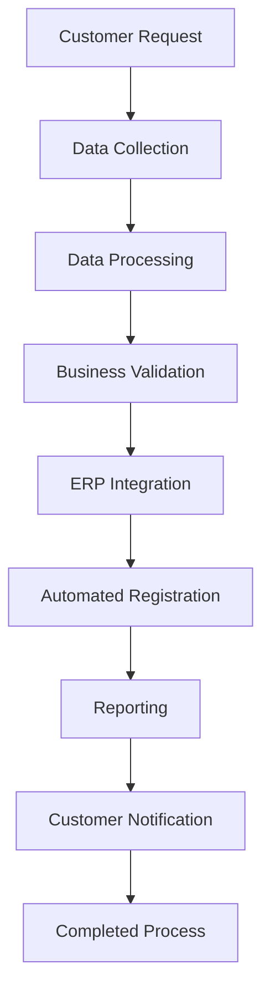

# Remote Self-Consumption Registration RPA

🌐 Language:
- 🇺🇸 English
- 🇧🇷 [Portuguese](README.pt-BR.md)

--- 

# 📌 Project Overview

This project was designed to fully automate a high-volume operational process responsible for handling customer requests received through a corporate web portal and processed within a legacy enterprise system.

The solution was developed in Python using RPA (Robotic Process Automation), Web Scraping, and ERP integration techniques, eliminating repetitive manual activities and significantly improving operational efficiency.

The workflow includes:
- Automatic request collection
- Individual file download
- Data processing and reconciliation
- Automated record updates
- Post-processing validation
- Report generation
- Automated email communication

---

# 🎯 Objectives

- Automate a manually executed operational process
- Reduce request processing time
- Eliminate operational errors
- Ensure SLA compliance
- Create traceability through reports and logs
- Free operational capacity for analytical activities

---

# 📊 Results Achieved

## Project Metrics
| Metric | Result |
|----------|----------|
| Records processed during testing | 2,274 records |
| Daily average | 117 records |
| Processing time reduction | 55% |
| Manual processing time | ~3 minutes per record |
| Automated processing time | ~1 minute per record |
| Current average processing time | 89 seconds per record |
| Lead time reduction | 19 days → D+1 |
| Operational capacity | Doubled |

---

# 🏢 Business Context

## What is Remote Self-Consumption?

Remote Self-Consumption is a Distributed Generation model in which the energy generated by a generating consumer unit can be shared among multiple consumer units belonging to the same owner.

In this model, surplus energy produced by the generating installation is allocated among beneficiary consumer units according to allocation percentages defined by the customer.

## Operational Process

The process begins when a customer submits a request through a customer service portal.

The request contains:
- Generating consumer unit
- Beneficiary consumer units
- Allocation percentage assigned to each beneficiary

After receiving the request, the information must be registered in the corporate system to ensure proper energy credit compensation.

## Automated Business Rules
The automation was developed considering multiple operational and regulatory validations.

### Allocation Distribution

The system ensures that:
- Each beneficiary receives a valid participation percentage.
- The allocation is distributed among all registered consumer units.
- The generating installation remains properly linked to all beneficiaries.
- Beneficiary limits are respected.
- Requests exceeding the operational limit for automatic processing are redirected for manual handling.

### Existing Registration Updates

Before creating a new allocation configuration, the system checks for existing registered beneficiaries.

When identified:
- Existing beneficiaries are removed.
- The new allocation configuration is inserted.
- The registration is saved again.

This procedure prevents inconsistencies between previous and new allocation configurations.

### Information Validation

The bot verifies:
- Presence of mandatory information.
- Consistency between request data and corporate system records.
- Availability of required files.
- Validity of allocation percentages.
- Process completion requirements.

After successful registration:
- Operational activities are executed automatically.
- The process is closed.
- Evidence is recorded.
- The customer receives an automatic completion notification.

---

# 🛠 Technologies Used
- Python
- Pandas
- OpenPyXL
- SAP GUI Scripting
- PyWinAuto
- PyAutoGUI
- Outlook COM
- Web Scraping
- CSV
- Excel

---

# 🏗 Solution Architecture

---

# ⚙️ Key Features

## Data Extraction
- Automated portal access
- Automatic file downloads
- Request data consolidation

## Data Processing
- Excel file processing
- CSV file processing
- Data standardization
- Cross-source data reconciliation

## Corporate System Integration
- Automated system navigation
- Record creation
- Data updates
- Automatic process completion

## Validation
- Business rule validation
- Consistency checks
- Exception handling
- Automatic retry mechanisms

## Communication
- Automated operational reports
- Completion notifications
- Error log generation

---

# 🚀 Automation Impact

## Before
- Fully manual process
- Individual file downloads
- High risk of rework
- Significant operational dependency
- Potential SLA delays

## After
- End-to-end automated execution
- Significant processing time reduction
- Process standardization
- Increased operational reliability
- Expanded capacity without team growth
- Greater focus on analytical and strategic activities
  
---

# 🧠 Technical Challenges
- **Legacy System Integration** – Automation developed using SAP GUI Scripting without API availability.
- **Handling Locked Records** – Automatic retry mechanisms for temporarily unavailable records.
- **Operational Resilience** – Processing designed to continue even when individual records encounter errors.
- **Multi-Source Data Consolidation** – Integration of information from web portals, CSV files, Excel spreadsheets, and corporate systems.

---

# 📈 Skills Demonstrated
- Robotic Process Automation (RPA)
- Python
- Data Processing with Pandas
- Systems Integration
- Excel Automation
- SAP GUI Scripting
- Exception Handling
- Process Engineering
- Continuous Improvement
- Reporting and Monitoring

---

# 📊 Monitoring Dashboard
To complement the automation, a Power BI dashboard was developed to track key operational performance indicators throughout the process.
The solution provides visibility into request volumes, productivity, SLA compliance, average processing time (TAT), and overall workflow performance, supporting data-driven decision-making and operational monitoring.

*Example of the dashboard developed to monitor the automated process:*
assets/dashboard_en.png

---

## ⚠️ Disclaimer
Due to confidentiality and intellectual property considerations, the complete source code and business-specific details are not publicly available.
This project is presented for demonstration purposes only, highlighting the solution architecture, technologies used, technical challenges addressed, and the results achieved.

---

## Author

**Vanessa Batista Fabri**

Data Analytics Portfolio Project

📌 LinkedIn: [linkedin.com/in/vanessafabri](https://www.linkedin.com/in/vanessafabri/)

📌 GitHub: [vanessabfabri](https://github.com/vanessabfabri)

