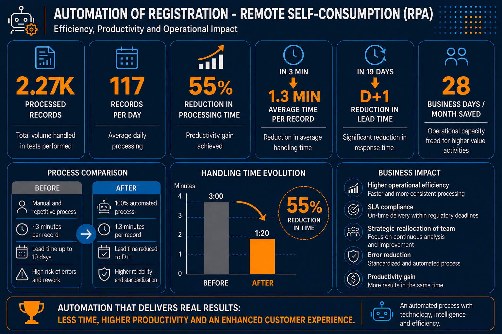
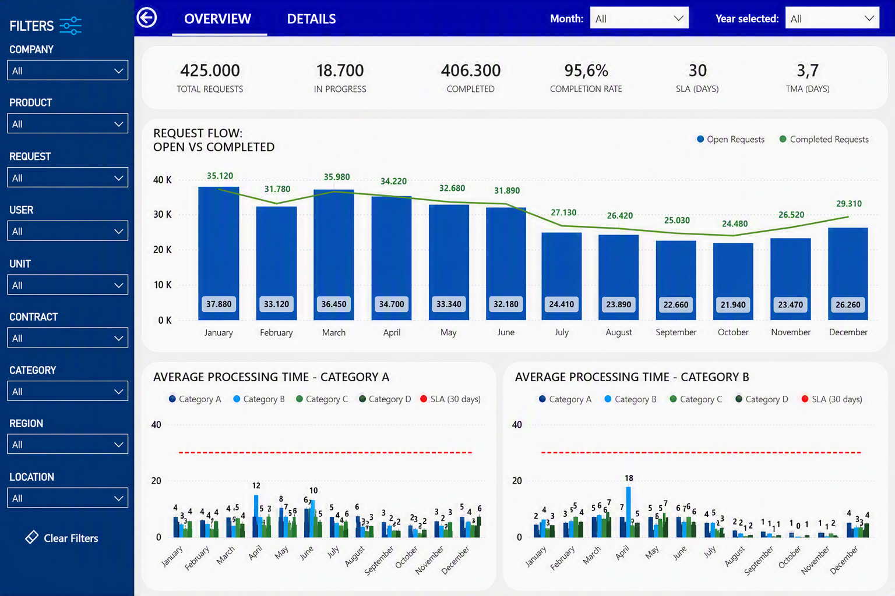

# Remote Self-Consumption Registration RPA

[🇺🇸 English](README.en.md) | [🇧🇷 Português](README.pt-BR.md)

Enterprise RPA solution for automating Remote Self-Consumption registration requests.

## Highlights

- +2,274 records processed
- 55% reduction in processing time
- SAP integration
- Automated reporting and notifications
- End-to-end workflow automation

 

## Dashboard
To complement the automation, a Power BI dashboard was developed to track key operational performance indicators throughout the process.

  

## Author

**Vanessa Batista Fabri**

Data Analytics Portfolio Project

📌 LinkedIn: [linkedin.com/in/vanessafabri](https://www.linkedin.com/in/vanessafabri/)

📌 GitHub: [vanessabfabri](https://github.com/vanessabfabri)
