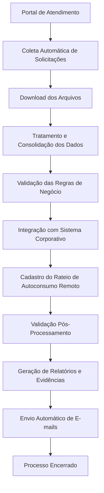

# Automação RPA de Cadastro de Autoconsumo Remoto

🌐 Idioma:
- 🇧🇷 Português
- 🇺🇸 [Inglês](README.en.md)

---

# 📌 Proposta do Projeto

Este projeto teve como objetivo automatizar integralmente um processo operacional de alto volume, responsável pelo tratamento de solicitações recebidas através de um portal corporativo e processadas em um sistema legado.

A solução foi desenvolvida em Python utilizando técnicas de RPA (Robotic Process Automation), Web Scraping e integração com sistema ERP, eliminando atividades repetitivas realizadas manualmente e garantindo maior eficiência operacional.

O fluxo inclui:

- Coleta automática de solicitações
- Download de arquivos individuais
- Tratamento e cruzamento de dados
- Atualização automática de registros
- Validação pós-processamento
- Geração de relatórios
- Comunicação automática por e-mail

---

# 🎯 Objetivos

- Automatizar um processo operacional executado manualmente
- Reduzir o tempo de tratamento das solicitações
- Eliminar erros operacionais
- Garantir o cumprimento dos SLAs
- Criar rastreabilidade através de relatórios e logs
- Liberar capacidade operacional da equipe para atividades analíticas

---

# 📊 Resultados Obtidos 
## Indicadores do Projeto 

| Indicador | Resultado | 
|------------|------------| 
| Volume tratado em testes | 2.274 registros | 
| Média diária | 117 registros | 
| Redução de tempo | 55% | 
| Tempo manual | ~3 minutos por registro | 
| Tempo automatizado | ~1 minuto por registro | 
| Tempo médio atual | 89 segundos por registro | 
| Redução do TMA | 19 dias → D+1 | 
| Capacidade operacional | Dobrada | 

---

# 🏢 Contexto de Negócio
O que é Autoconsumo Remoto?

O Autoconsumo Remoto é uma modalidade da Micro e Minigeração Distribuída na qual a energia gerada por uma unidade consumidora geradora pode ser compartilhada com outras unidades consumidoras pertencentes ao mesmo titular.

Nessa modalidade, a energia excedente produzida pela instalação geradora é distribuída entre unidades beneficiárias de acordo com percentuais previamente definidos pelo cliente.

## Processo Operacional

O processo inicia quando o cliente realiza uma solicitação através do portal de atendimento.

Nessa solicitação são informados:
- Unidade consumidora geradora
- Unidades consumidoras beneficiárias
- Percentual de rateio destinado a cada beneficiária

Após o recebimento da solicitação, é necessário registrar essas informações no sistema corporativo para que a compensação de créditos de energia seja realizada corretamente.

## Regras de Negócio Automatizadas
A automação foi desenvolvida considerando diversas validações operacionais e regulatórias.

### Distribuição dos Rateios
O sistema deve garantir que:
- Cada beneficiária possua um percentual de participação válido.
- O rateio seja distribuído entre todas as unidades cadastradas.
- A instalação geradora permaneça corretamente vinculada às beneficiárias.
- Limite de Beneficiárias
- Registros acima do limite operacional definido para processamento automático são direcionados para tratamento manual.

### Atualização de Cadastros Existentes
Antes da inclusão de um novo rateio, o sistema deve verificar se existem beneficiárias previamente cadastradas.
Quando identificadas:
- As beneficiárias existentes são removidas.
- O novo rateio é incluído.
- O cadastro é salvo novamente.
Esse procedimento evita inconsistências entre rateios antigos e novos.

### Validação das Informações
O robô verifica:
- Existência de dados obrigatórios.
- Correspondência entre solicitação e sistema corporativo.
- Disponibilidade dos arquivos necessários.
- Consistência dos percentuais informados.
- Encerramento do Processo

Após o cadastro completo:
- As medidas operacionais são executadas automaticamente.
- O registro é encerrado.
- Evidências são registradas.
- O cliente recebe uma comunicação automática de conclusão.

---

# 🛠 Tecnologias Utilizadas
- Python
- Pandas
- OpenPyXL
- SAP GUI Scripting
- PyWinAuto
- PyAutoGUI
- Outlook COM
- Web Scraping
- CSV
- Excel

---

# 🏗 Arquitetura da Solução

--- 

# ⚙️ Principais Funcionalidades 
## Extração de Dados 
- Acesso automatizado ao portal
- Download automático dos arquivos individuais
- Consolidação das informações recebidas
  
## Tratamento de Dados 
- Leitura de planilhas Excel
- Leitura de arquivos CSV
- Padronização de dados
- Cruzamento entre diferentes fontes

## Integração com Sistema Corporativo 
- Navegação automática
- Inclusão de registros
- Atualização de informações
- Encerramento automático de processos

## Validações 
- Regras de negócio
- Conferência de consistência
- Tratamento de exceções
- Retentativas automáticas

## Comunicação 
- Envio automático de relatórios operacionais
- Notificação de conclusão
- Geração de logs de erro

--- 

# 🚀 Impacto da Automação 
### Antes 
- Processo totalmente manual
- Download individual dos arquivos
- Alto risco de retrabalho
- Dependência operacional elevada
- Possibilidade de atraso nos prazos

### Depois 
- Execução automática ponta a ponta
- Redução significativa do tempo de processamento
- Padronização do processo
- Maior confiabilidade operacional
- Capacidade ampliada sem aumento de equipe
- Liberação da equipe para atividades analíticas e estratégicas

--- 

# 🧠 Desafios Técnicos 
- Integração com Sistema Legado Desenvolvimento de automação utilizando SAP GUI Scripting, sem utilização de APIs. 
- Tratamento de Bloqueios Implementação de retentativas automáticas para registros temporariamente indisponíveis. 
- Robustez Operacional O processamento foi desenvolvido para continuar executando mesmo diante de erros individuais. 
- Consolidação de Múltiplas Fontes Integração de informações provenientes de portais web, arquivos CSV, planilhas Excel e sistema corporativo. 

--- 

# 📈 Competências Demonstradas
- Automação de Processos (RPA)
- Python
- Manipulação de Dados com Pandas
- Integração de Sistemas
- Excel Automation
- SAP GUI Scripting
- Tratamento de Exceções
- Engenharia de Processos
- Melhoria Contínua
- Geração de Relatórios

---

# 📷 Imagens do Projeto
- Fluxo da Automação
Inserir imagem do fluxo do processo.
assets/fluxo-rpa.png

- Arquitetura da Solução
Inserir diagrama de arquitetura.
assets/arquitetura-rpa.png

- Dashboard de Acompanhamento
Inserir dashboard com dados anonimizados.
assets/dashboard.png

---

# ⚠️ Observação
Por questões de confidencialidade e propriedade intelectual, o código-fonte completo e detalhes específicos de negócio não são disponibilizados publicamente.
O projeto é apresentado com finalidade demonstrativa, evidenciando a arquitetura, tecnologias empregadas, desafios enfrentados e resultados obtidos.

---

## Autora

**Vanessa Batista Fabri**

Projeto de Portfólio em Análise de Dados

📌 LinkedIn: [linkedin.com/in/vanessafabri](https://www.linkedin.com/in/vanessafabri/)

📌 GitHub: [vanessabfabri](https://github.com/vanessabfabri)
